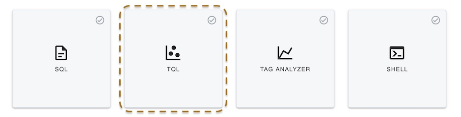
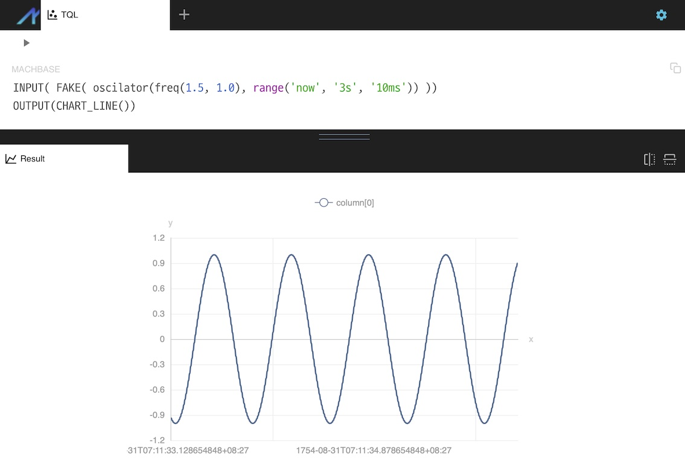

# TQL API

Machbase Neo supports Transforming Query Language and execution API.

As application developers, we generally takes similar approch to build a data utilizing application.
This process is typically starting with quering database and retrieving data in a tabular form(rows and colums), converting it into desired data structure,
then manipulating and displaying the final result into desied shape such as JSON, CSV or chart.

TQL is simplifing this process in few lines of script. And other inter-working application calls the TQL via HTTP endpoint as if it is an executable API.


{: .warning }
> Currently TQL feature is in beta stage. The syntax of script is subject of changes.

## Glance at TQL

1. Open machbase-neo web UI with your web browser, the default address is http://127.0.0.1:5654/, username 'sys' and password 'manager'.
2. Select "TQL" on the 'New Tab...' page.
    
3. Copy and paste the sample TQL codes into the TQL editor
    ```
    INPUT( FAKE( oscilator(freq(1.5, 1.0), range('now', '3s', '10ms')) ))
    OUTPUT(CHART_LINE())
    ```
4. Then click "play" icon on the top left of the editor, it will display line chart like below image.
    which is a wave that has 1.5 Hz frequency and 1.0 amplitude.
    
5. Change `OUTPUT(CHART_LINE())` to `OUTPUT(CSV())` and execute, it will show the result in CSV format.
6. Save this code as `hello.tql` (click save icon on the top of the editor) and open it with web browser at [http://127.0.0.1:5654/db/tql/hello.tql](http://127.0.0.1:5654/db/tql/hello.tql).
This feature is the simplest way for deveropers to create RESTful APIs providing other applications accessing data.

This example takes data from "fake" data generator instead of "real" database stored.
We will show how to get the real data from database and various way to display the result through the tutorials.