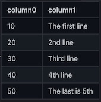
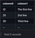
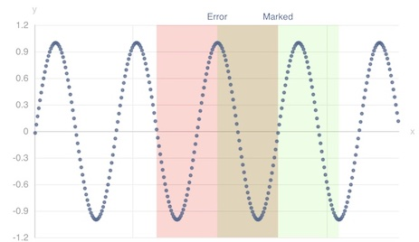

# Data Sink
{: .no_toc}

*Syntax*: `CSV() | JSON() | INSERT() | APPEND() | MARKDOWN() | CHART_???()`

All *tql* scripts must end with one of the sink functions.

1. TOC
{: toc}

## CSV()

*Syntax*: `CSV()`

Makes the records of the result in CSV format. The key of records becomes the first field and values are following.

For example, if a record was `{key: k, value:[v1,v2]}`, it generates an CSV records as `k,v1,v2`.

## JSON()

*Syntax*: `JSON( [transpose(boolean)] )`

Generates JSON results from the key-value records.

## INSERT()

*Syntax*: `INSERT( [bridge,] columns..., table, tag )`

*INSERT()* stores incoming records into specified databse table by an 'INSERT' statement for each record.

- `bridge` *bridge('name')*
- `columns` *string*
- `table` *table('name')*
- `tag` *tag('name')*


## APPEND()

*Syntax*: `APPEND( table(string) )`

*APPEND()* stores incoming records into specified databse table via the 'append' method of machbase-neo.

## MARKDOWN()

Generates a table in markdown format or HTML.

*Syntax*: `MARKDOWN( [html(), rownum(), brief(), briefCount() ] )`

- `html(boolean)` produce result by HTML renderer, default `false`
- `rownum(boolean)` show rownum column
- `brief(boolean)` omit result rows, `brief(true)` is equivalent with `briefCount(5)`
- `briefCount(limit int)` omit result rows if the records exceeds the given limit, no omition if limit is `0`

```js
STRING(payload() ??  `The first line 
                      2nd line
                      Third line
                      4th line
                      The last is 5th`, separator('\n'))
MARKDOWN()
```



If `briefCount()` is applied...

```js
MARKDOWN( briefCount(3) )
```



## CHART_LINE()

*Syntax*: `CHART_LINE()`

Generates a line chart in HTML format.

## CHART_BAR()

*Syntax*: `CHART_BAR()`

Generates a bar chart in HTML format.

## CHART_SCATTER()

*Syntax*: `CHART_SCATTER()`

Generates a scatter chart in HTML format.

## CHART_LINE3D

*Syntax*: `CHART_LINE3D()`

Generates a 3D line chart in HTML format.

## CHART_BAR3D()

*Syntax*: `CHART_BAR3D()`

Generates a 3D bar chart in HTML format.

## CHART_SCATTER3D()

*Syntax*: `CHART_SCATTER3D()`

Generates a 3D scatter chart in HTML format.

## Chart options

### size()
{: .no_toc}

*Syntax*: `size(width, height)`

- `width` `string` chart width in HTML syntax ex) '800px'
- `height` `string` chart height in HTML syntax ex) '800px'

### title()
{: .no_toc}

*Syntax*: `title(label)`

- `label` `string`

### subtitle()
{: .no_toc}

*Syntax*: `subtitle(label)`

- `label` `string`

### xAxis(), yAxis(), zAxis()
{: .no_toc}

*Syntax*: `xAxis(idx, label [, type])`

- `idx` `number` index of column for the axis
- `label` `string` label of the axis
- `type` `string` type fo the axis, available: `'time'` and `'value'`, default is `'value'` if not specified.

> zAxis() is effective only with 3D chart

### dataZoom()
{: .no_toc}

*Syntax*: `dataZoom(type, minPercentage, maxPercentage)`

- `type` `string` "slider", "inside"
- `minPercentage` `number` 0 ~ 100
- `maxPercentage` `number` 0 ~ 100

> 2D chart only

### opacity()
{: .no_toc}

*Syntax*: `opacity(alpha)`

- `alpha` `number` 0.0 ~ 1.0

> 3D chart only

### autoRotate()
{: .no_toc}

*Syntax*: `autoRotate( [speed] )`

- `speed` *number* degree/sec, default is 10

### gridSize()
{: .no_toc}

*Syntax*: `gridSize( width, height, [depth] )`

- `width` *number* percentage (default: 100)
- `height` *number* percentage (default: 100)
- `depth` *number* percentage (default: 100)

<!--
### showGrid() -- not working(go-echarts bug?)

*Syntax*: `showGrid(boolean)`
-->

### visualMap()
{: .no_toc}

*Syntax*: `visualMap(min, max)`

- `min` `number`
- `max` `number`

> 3D chart only

### markArea()
{: .no_toc}

*Syntax*: `markArea(coord0, coord1 [, label [, color [, opacity]]])`

- `coord0` *any* : area begining x-value
- `coord1` *any* : area ending x-value
- `label` *string* : title
- `color` *string* : color of area
- `opacity` *number* : 0~1 of opacity

*Example)*

```js
FAKE( oscillator(freq(1.5, 1.0), range('now', '3s', '10ms')) )
CHART_SCATTER(
  markArea(time('now+1s'), time('now+2s'), 'Error', '#ff000033'),
  markArea(time('now+1.5s'), time('now+2.5s'), 'Marked', '#22ff0022')
 )
```



### markXAxis()
{: .no_toc}

*Syntax*: `markXAxis(coord, label)`

- `coord` *any* : marked x-value
- `label` *string* : title

### markYAxis()
{: .no_toc}

*Syntax*: `markYAxis(coord, label)`

- `coord` *any* : marked y-value
- `label` *string* : title

### theme()
{: .no_toc}

*Syntax*: `theme(name)`

- `name` `string` theme name

Apply a chart theme.

Available themes : `chalk`, `essos`, `infographic`, `macarons`, `purple-passion`, `roma`, `romantic`, `shine`, `vintage`, `walden`, `westeros`, `wonderland`

<!--
### assetHost()

*Syntax*: `assetHost(url)`

- `url` *string* change download url for the apache-charts assets. (default: `/web/echarts/`)

*Example)*

```
CHART_LINE( assetHost('https://cdn.example.com/charts/assets/') )
```
-->
