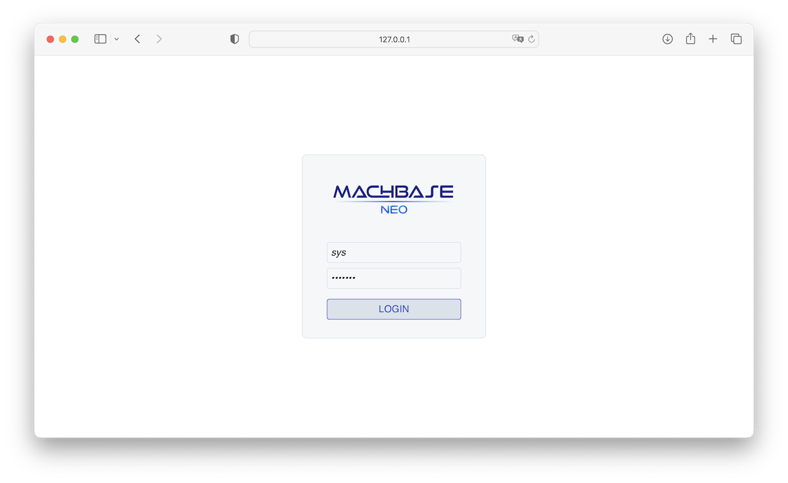
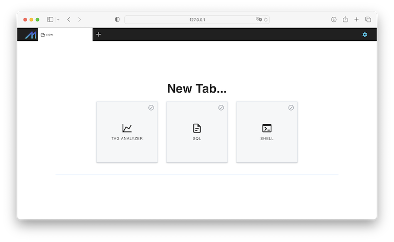
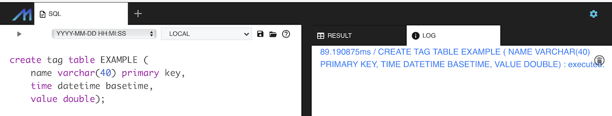
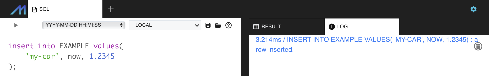
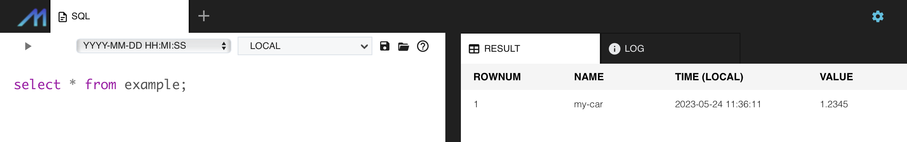

# Quick Start
{:.no_toc}

1. TOC
{:toc}

## Download

Use the instant download with the script below.

```sh
sh -c "$(curl -fsSL https://neo.machbase.com/install.sh)"
```

Or, download the latest version for your platform from [releases](/releases) page.
Then unarchive the file into a preferred directory.

```sh
unzip machbase-neo-${edition}-v${X.Y.Z}-${platform}-${arch}.zip
```

## Start machbase-neo on linux and macOS

Execute `machbase-neo serve` to start the server process with default settings,
it creates a new database directory `machbase_home` in the same directory where the executable file is.

```sh 
./machbase-neo serve
```


## Start machbase-neo on Windows

On Windows, double click "neow.exe" and "machbase-neo serve" button of the top left on the window.


## Open WebUI

Open http://127.0.0.1:5654/ with web browser. Enter ID/Password as 'sys' and 'manager' which is the default.



Select "SQL" to open a new sql editor tab.



## Create table

The page shows the SQL editor on left panel and result and logs are on the right panel.

Copy the below DDL statement and pate it to the editor.

```sql
create tag table EXAMPLE (
    name varchar(40) primary key,
    time datetime basetime,
    value double);
```

Execute the statement by hit "Ctrl+Enter" or click the "play" icon on the top-left of the panel. Don't forget the semi-colon of the end of the statement.




## Insert

Execute the statement below to write a single record of data.

```sql
insert into EXAMPLE values(
    'my-car', now, 1.2345
);
```



## Query

Execute the select statement below, it will show the result on the right tabular panel.

```sql
select * from example
```



## Drop table

```sql
drop table EXAMPLE
```
