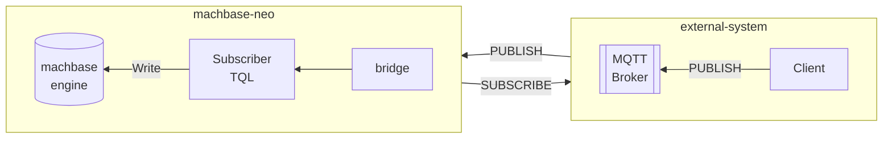

# Glance at Subscriber
{: .no_toc}

1. TOC
{: toc}

A simple use case is that make a bridge to the external MQTT broker, and define a subscriber with 
1) the bridge, 2) a topic of the MQTT broker and 3) *tql* script path. Then machbase-neo works as 
MQTT client and whenever it receives messages, it passes them to the sepcified *tql* script.

## Register a subscriber

Register subscribers.

**Syntax:** `subscriber add [options] <name> <bridge> <topic> <tql-path>`

- options
    - `--autostart` makes the subscriber will start automatically when machbase-neo starts.
        If the subscriber is not *autostart* mode, you can make it start and stop manually by
        `subscriber start <name>` and `subscriber stop <name>` commands.
    - `--qos` if the bridge is MQTT type, specify the QoS level of the subscription to the topic.
        It supports `0`, `1` and the default is `0` if it is not specified.

- `<name>`      subscriber's name
- `<bridge>`    specify pre-defined bridge, it should be a type of the broker
- `<topic>`     topic to subscribe
- `<tql-path>`  the *tql* script that handles the received message

## Subscriber Status

**Syntax:** `subscriber list`

- `STOP`
- `RUNNING`

## Subscriber Start/Stop

**Syntax:** `subscriber [start | stop] <name>`

## Remove subscriber

**Syntax:** `subscriber del <name>`
