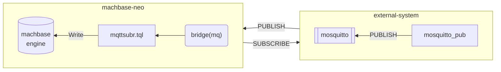

# MQTT Subscriber
{: .no_toc}

1. TOC
{: toc}

Let's make a practical example that receives messages from MQTT broker and storing the data into database utilizing bridage and subscriber.

In this demonstration we will use the `mosquitto` as MQTT broker and `mosquitto_pub` as MQTT client



## Run MQTT Broker

It is possible to use that any MQTT broker that is compatible MQTT v3.1.1 specification.

If you don't have MQTT broker, install and run mosquitto for the demo. [https://mosquitto.org](https://mosquitto.org)

```sh
$ mosquitto -p 1883

1691466522: mosquitto version 2.0.15 starting
1691466522: Using default config.
1691466522: Starting in local only mode. Connections will only be possible from clients running on this machine.
1691466522: Create a configuration file which defines a listener to allow remote access.
1691466522: For more details see https://mosquitto.org/documentation/authentication-methods/
1691466522: Opening ipv4 listen socket on port 1883.
1691466522: Opening ipv6 listen socket on port 1883.
1691466522: mosquitto version 2.0.15 running
```

## Register bridge

Open machbase-neo shell, and execute `bridge add...` command.

```
bridge add -t mqtt mq broker=127.0.0.1:1883 id=demo;
```

It defines how machbase-neo can connect to the desired broker.

```
machbase-neo» bridge list;
╭────────┬──────────┬─────────────────────────────────╮
│ NAME   │ TYPE     │ CONNECTION                      │
├────────┼──────────┼─────────────────────────────────┤
│ mq     │ mqtt     │ broker=127.0.0.1:1883 id=demo   │
╰────────┴──────────┴─────────────────────────────────╯
```

When the bridge `mq` successfuly registered, machbase-neo connects to the specified broker and mosquitto displays the connection log like below.

If there is any network problem or the broker is down, 
machbase-neo is periodically retry to connect,
so that it keeps the best efforts to make the bridge available.

```
1691466529: New connection from 127.0.0.1:65440 on port 1883.
1691466529: New client connected from 127.0.0.1:65440 as demo (p2, c1, k30).
```

## Make data transformation and writing script `mqttsubr.tql`

Open machbase-neo *TQL* editor, and copy the code below and save it as `mqttsubr.tql`.

```js
BYTES(CTX.Body)
SCRIPT(`
  // get current time
  times := import("times")
  ts := times.now()
  // get the payload of the message
  ctx := import("context")
  val := ctx.value()
  // parse json
  json := import("json")
  msg := json.decode(val[0])
  // yield key-value records
  ctx.yieldKey(msg.client+".temp", ts, msg.data.temp)
  ctx.yieldKey(msg.client+".humidity", ts, msg.data.humidity)
`)
APPEND(table("example"))
```

This script gets the payload of incoming messages with `BYTES(CTX.Body)`. 
Parse and transforming the data shape to properly write into the table `example`.

First since the message dosn't contains timestamp, it gets current time to apply the timestamp.
And decode the json payload then yields two new records which are `temp` and `humidity`.

## Register subscriber

Open machbase-neo shell to add a new subscriber which makes a relation between the bridge and the *tql* script.

```sh
subscriber add --autostart --qos 1 mqttsubr mq iot/sensor /mqttsubr.tql;
```

Check the newely register subscriber is in `RUNNING` state.
Since we register the subscriber with `--autostart` option, it will automatically start when machbase-neo start.

```
machbase-neo» subscriber list;
╭──────────┬────────┬────────────┬───────────────┬───────────┬─────────╮
│ NAME     │ BRIDGE │ TOPIC      │ TQL           │ AUTOSTART │ STATE   │
├──────────┼────────┼────────────┼───────────────┼───────────┼─────────┤
│ MQTTSUBR │ mq     │ iot/sensor │ /mqttsubr.tql │ true      │ RUNNING │
╰──────────┴────────┴────────────┴───────────────┴───────────┴─────────╯
```

## Send a message with `mosquitto_pub`

Make a data file `data.json` as like below.

```json
{
  "client":"mqtt-demo",
  "data":{"temp":34.1, "humidity":67.8}
}
``` 

Execute `mosquitto_pub` to publish the `data.json` to the MQTT broker.

```sh
mosquitto_pub -d -h 127.0.0.1 -p 1883 \
    -t iot/sensor \
    -f data.json
Client null sending CONNECT
Client null received CONNACK (0)
Client null sending PUBLISH (d0, q0, r0, m1, 'iot/sensor', ... (68 bytes))
Client null sending DISCONNECT
```

Query the stored data.

```sh
machbase-neo» select * from example where name = 'mqtt-demo.temp';
╭────────┬────────────────┬─────────────────────────┬───────────╮
│ ROWNUM │ NAME           │ TIME(LOCAL)             │ VALUE     │
├────────┼────────────────┼─────────────────────────┼───────────┤
│      1 │ mqtt-demo.temp │ 2023-08-08 13:51:37.923 │ 34.100000 │
╰────────┴────────────────┴─────────────────────────┴───────────╯

machbase-neo» select * from example where name = 'mqtt-demo.humidity';
╭────────┬────────────────────┬─────────────────────────┬───────────╮
│ ROWNUM │ NAME               │ TIME(LOCAL)             │ VALUE     │
├────────┼────────────────────┼─────────────────────────┼───────────┤
│      1 │ mqtt-demo.humidity │ 2023-08-08 13:51:37.923 │ 67.800000 │
╰────────┴────────────────────┴─────────────────────────┴───────────╯
```