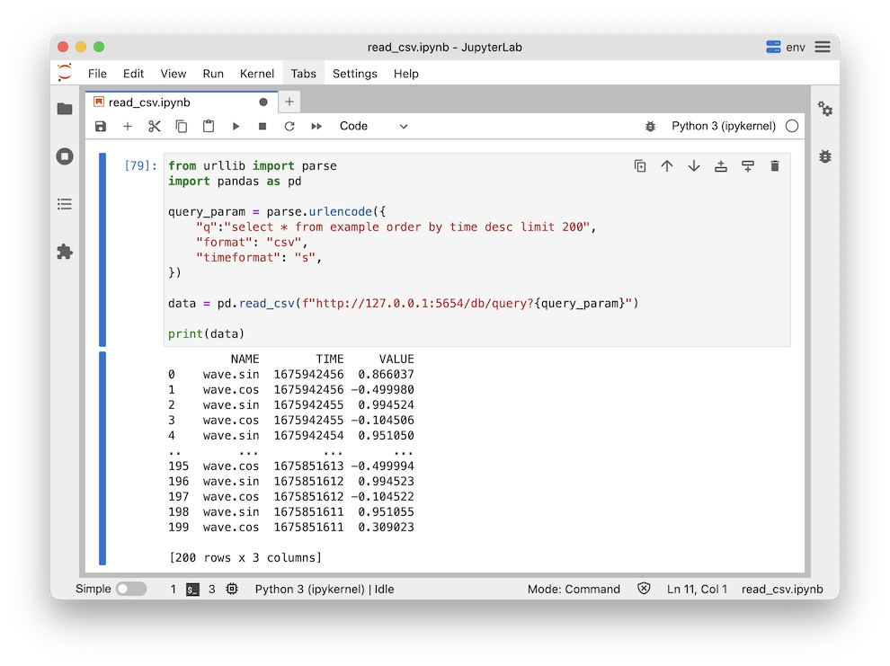

# Load Pandas.DataFrom directly from HTTP API.

This example shows how to load data into pandas dataframe via machbase-neo HTTP API.



Import pandas and urllib.

```py
from urllib import parse
import pandas as pd
```

Make query url for `"format": "csv"` option, then call `read_csv`.
Use `timeformat` to specify the precision of time data. `s`, `ms`, `us` and `ns`(default) are available.

```py
query_param = parse.urlencode({
    "q":"select * from example order by time limit 200",
    "format": "csv",
    "timeformat": "s",
})
data = pd.read_csv(f"http://127.0.0.1:5654/db/query?{query_param}")
print(data)
```
